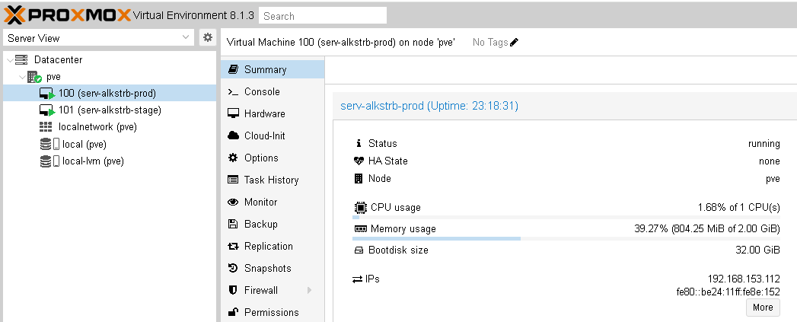
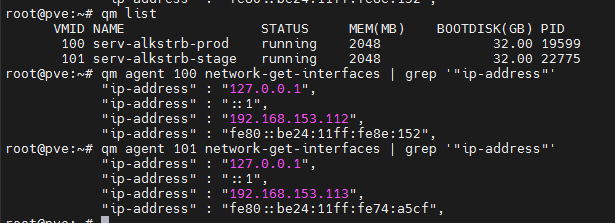
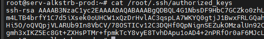
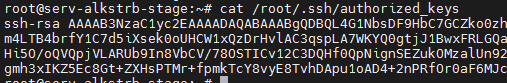
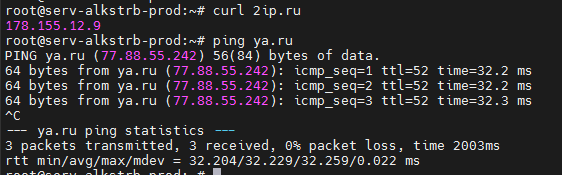
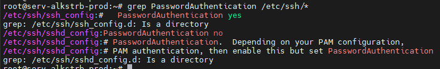
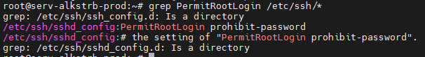

# #s1e0 Подготовка лаборатории

## Подготовили инфраструктуру:

## Адреса серверов

## Разместили ключи ssh

## Проверка доступа в интернет

## Отключение входа по паролю

## Подключение под рутом

