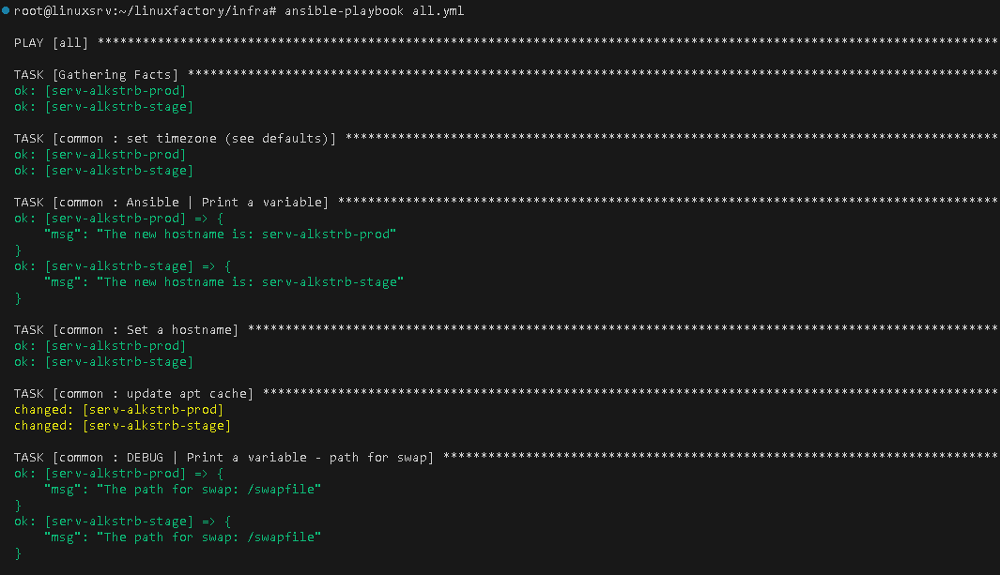
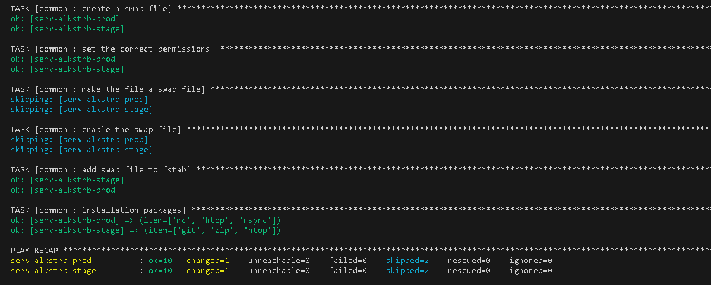

# #s1e14 Ansible HOSTS

## HOSTS

[hosts:](https://github.com/AleksTurbo/infra/blob/main/hosts)

## Запускаем PLAY

## Links

[INFRA repo:](https://github.com/AleksTurbo/infra)

[ansible-roles:](https://github.com/AleksTurbo/ansible-roles)
