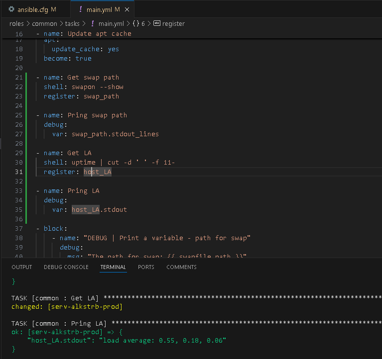
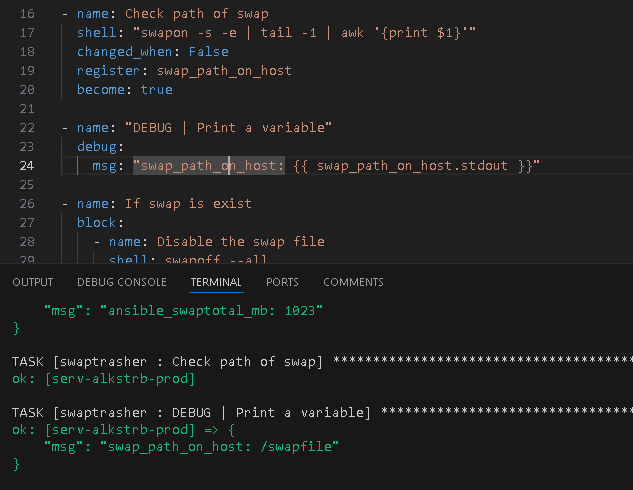
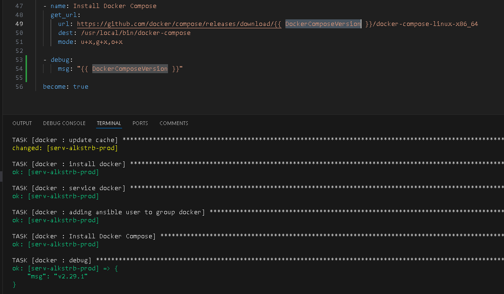

# #s1e15 Ansible

## Задача 1 - Выводим LA

## Задача 2 - путь swap

## Задача 3 - версия docker-compose

## Links

[INFRA repo:](https://github.com/AleksTurbo/infra)

[ansible-roles:](https://github.com/AleksTurbo/ansible-roles)
