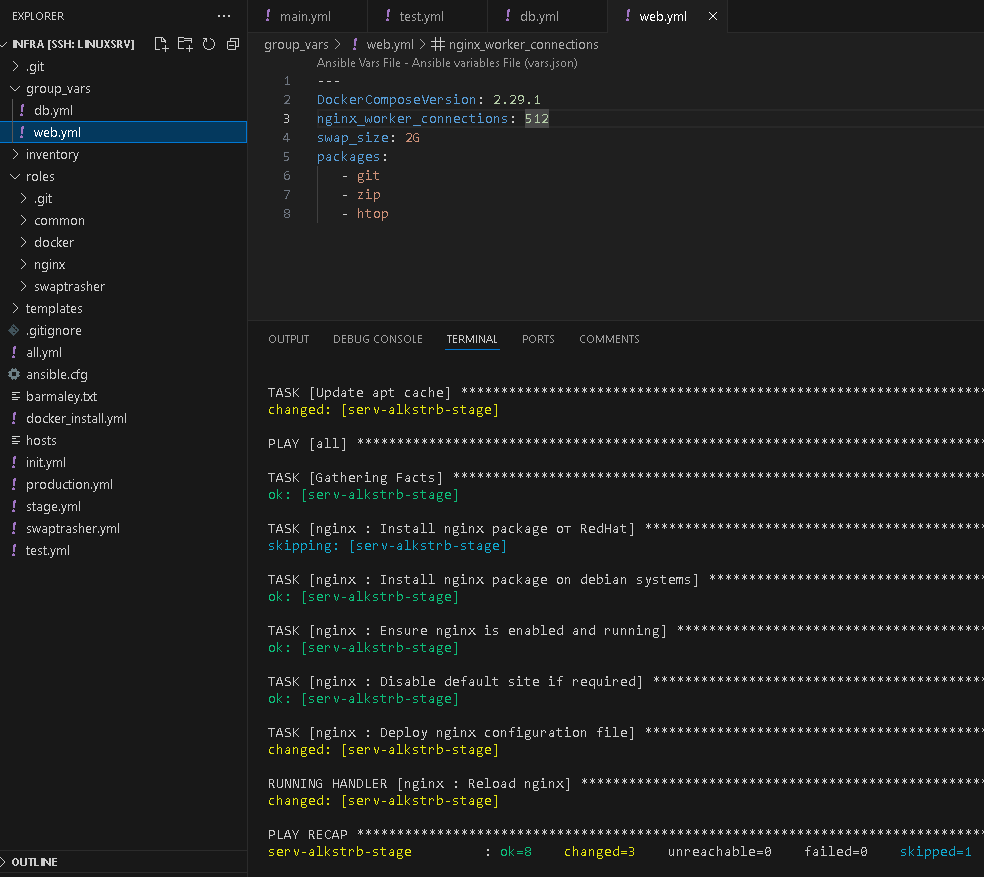
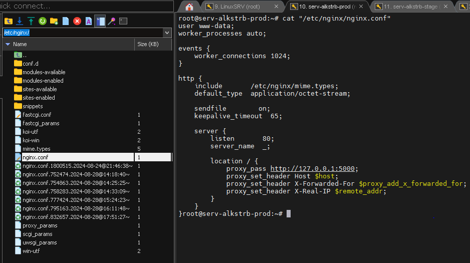
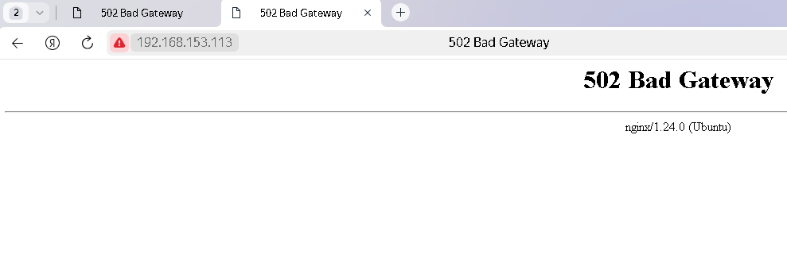

# #s1e16 Ansible NGINX

## Задача 1

## Устанавливаем NGINX

## Конфигурируем NGINX

## Проверяем работоспособность

## Links

[INFRA repo:](https://github.com/AleksTurbo/infra)

[ansible-roles:](https://github.com/AleksTurbo/ansible-roles)
