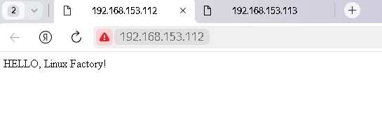

# #s1e17 GitLAb Деплой

## Задача 1

## Модернизация PipeLINE

[.gitlab-ci.yml:](./gitlab/.gitlab-ci.yml)

P.S. - нумерацию ранеров поменял, чтобы с предудущими было одинаково:

```yml
- if: '$CI_COMMIT_REF_NAME == "develop"'
      variables:
        RUNNER_TAG: "lf-runner1"
        RUNNER_SHELL_TAG: "lf-runner-shell1"
    - if: '$CI_COMMIT_REF_NAME == "main"'
      variables:
        RUNNER_TAG: "lf-runner2"
        RUNNER_SHELL_TAG: "lf-runner-shell2"
```

## Проверяем работоспособность


## registry


## Проверяем результат




## Links

[INFRA repo:](https://github.com/AleksTurbo/infra)

[ansible-roles:](https://github.com/AleksTurbo/ansible-roles)
