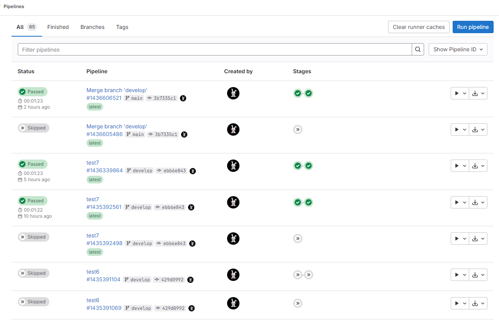
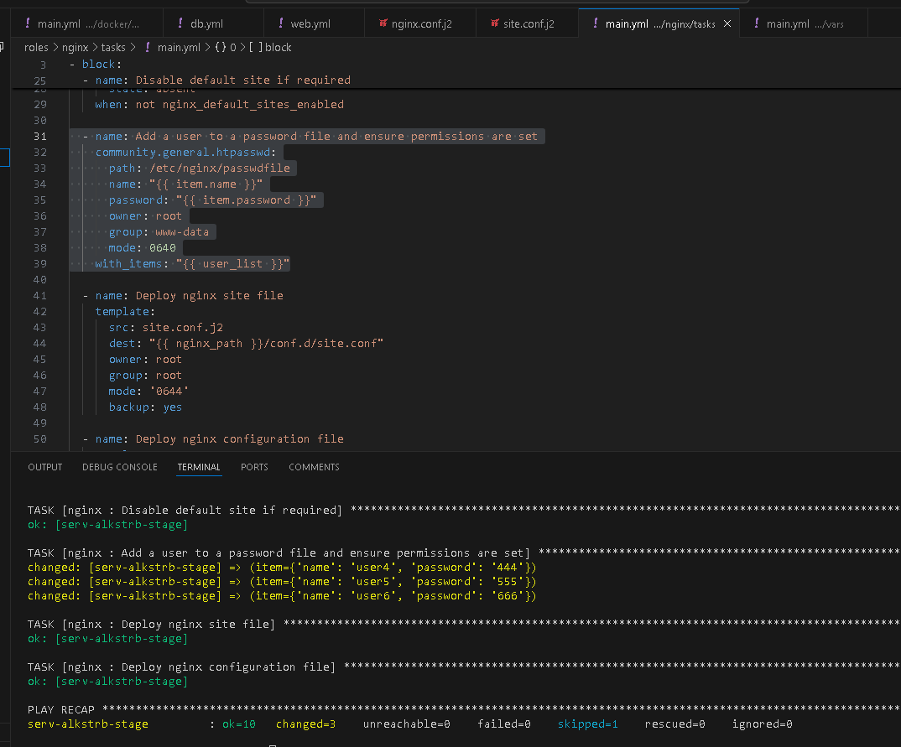

# #s1e18 GitLAb Рукоблудие

## Задача 1 - Ручной запуск PipeLine с выбором

## Модернизация PipeLINE

[.gitlab-ci.yml:](./gitlab/.gitlab-ci.yml)

P.S. - Вцелом работает, но немного не корректно срабатывает выбор сервера для деплоя :




## Задача 2 - Nginx Proxy_pass

```bash
    location /{{ app_location }}  {
        proxy_pass {{ ip_proxy_host }}:{{ proxy_port }}/;
        proxy_set_header Host $host;
        proxy_set_header X-Forwarded-For $proxy_add_x_forwarded_for;
        proxy_set_header X-Real-IP $remote_addr;
    }
```

## Задача 3 - Nginx Basic auth

```ini
http {
    include       /etc/nginx/mime.types;
    default_type  application/octet-stream;

    sendfile        on;
    keepalive_timeout  65;

    auth_basic "Restricted area";
    auth_basic_user_file /etc/nginx/passwdfile;

    include /etc/nginx/conf.d/*.conf;
}
```




## Links

[INFRA repo:](https://github.com/AleksTurbo/infra)

[ansible-roles:](https://github.com/AleksTurbo/ansible-roles)
