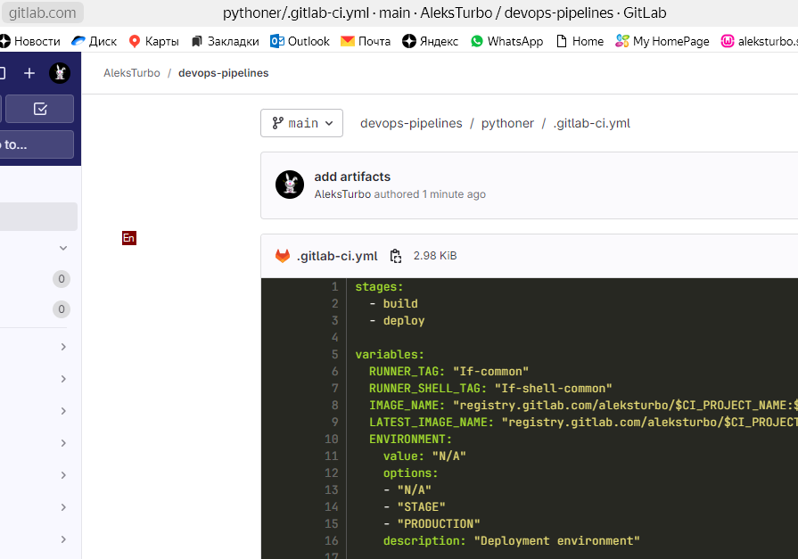
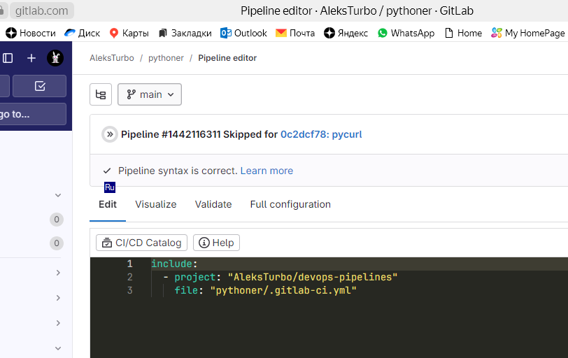
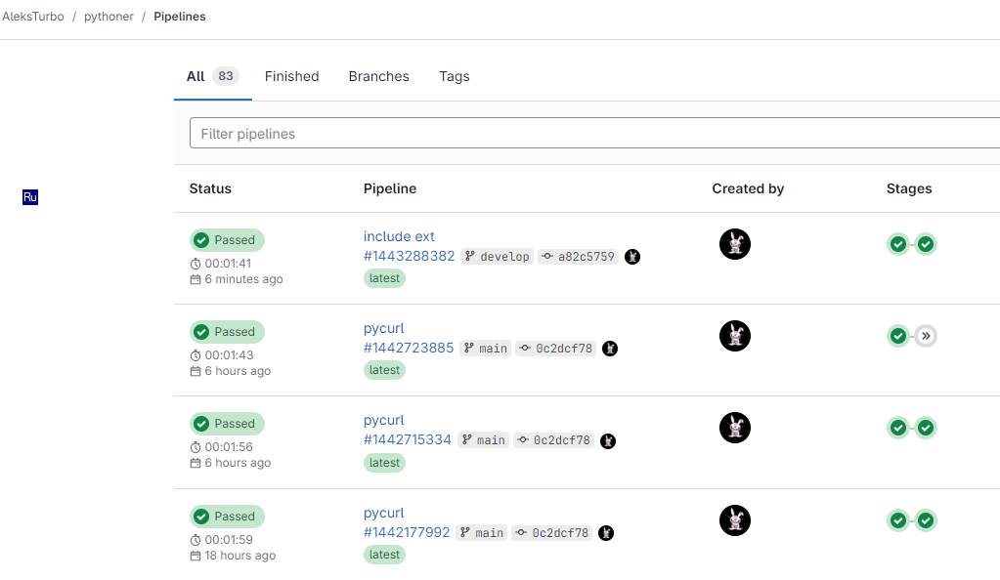

# #s1e19 GitLAb Оптимизация

## Отдельный проект для PipeLine

[.gitlab-ci.yml:](./gitlab/.gitlab-ci.yml)

## Инклюдим

## Проверяем

## Links

[INFRA repo:](https://github.com/AleksTurbo/infra)

[ansible-roles:](https://github.com/AleksTurbo/ansible-roles)
