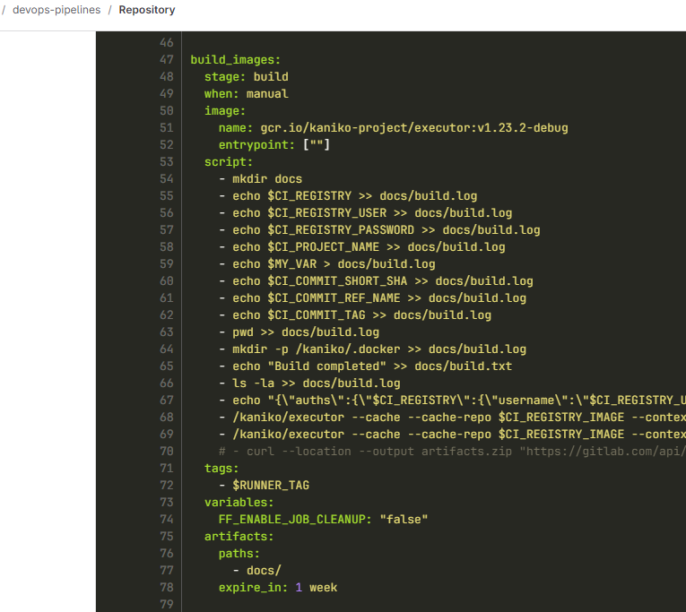
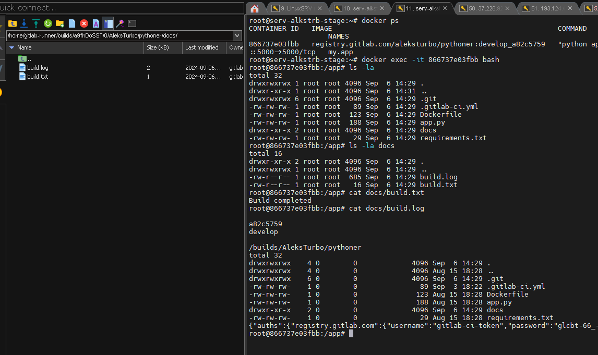
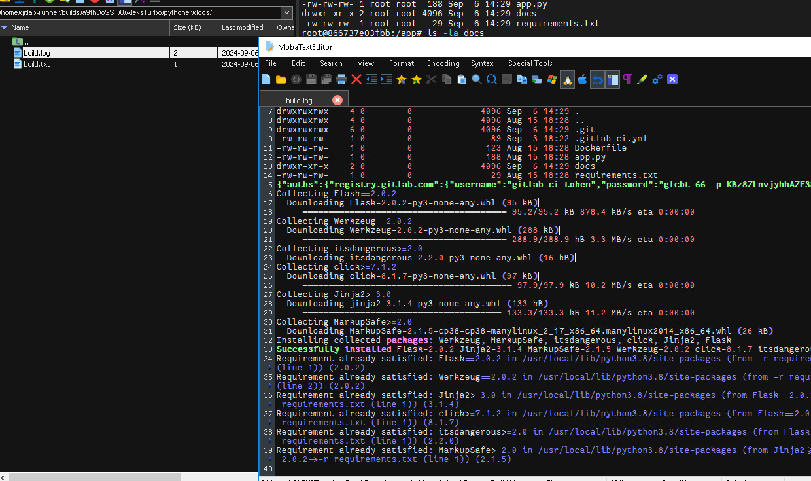

# #s1e20 GitLAb Артифакты

## Сохраняем артефакты сборки

[.gitlab-ci.yml:](./gitlab/.gitlab-ci.yml)

## Артифакты на хосте и в докере

## Links

[INFRA repo:](https://github.com/AleksTurbo/infra)

[ansible-roles:](https://github.com/AleksTurbo/ansible-roles)
