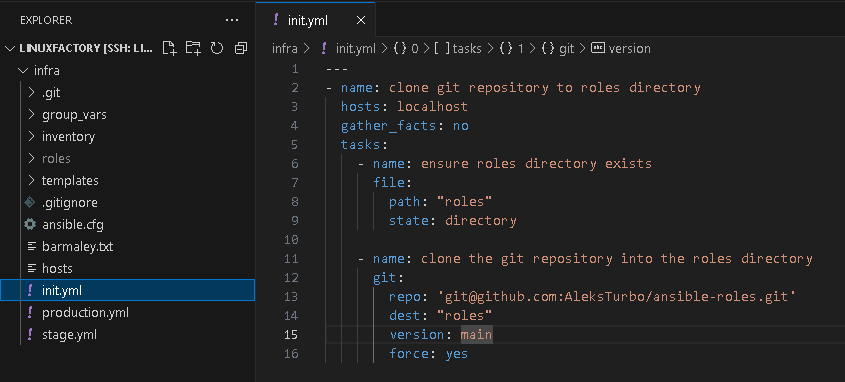
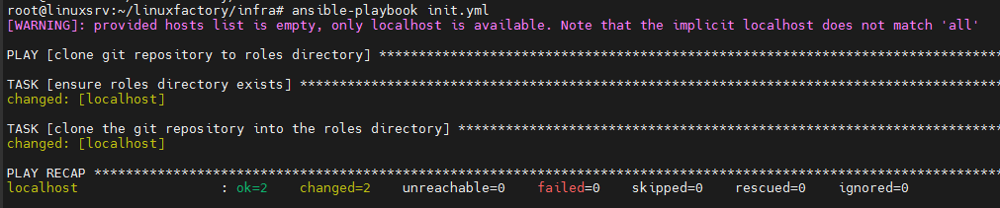

# #s1e5 Ansible 

## Импортируем роль в проект

## Ссылки на репозитории:

[INFRA repo:](https://github.com/AleksTurbo/infra)

[Roles repo:](https://github.com/AleksTurbo/ansible-roles)

## Особенности GIT при работе с пустыми папками:

Git не игнорирует пустые каталоги. Он игнорирует все каталоги. В Git каталоги существуют только неявно, через их содержимое. Пустые каталоги не содержат содержимого, следовательно, они не существуют. Или, другими словами: Git - это средство отслеживания содержимого. Пустые каталоги - это не содержимое - это средство организации структуры.