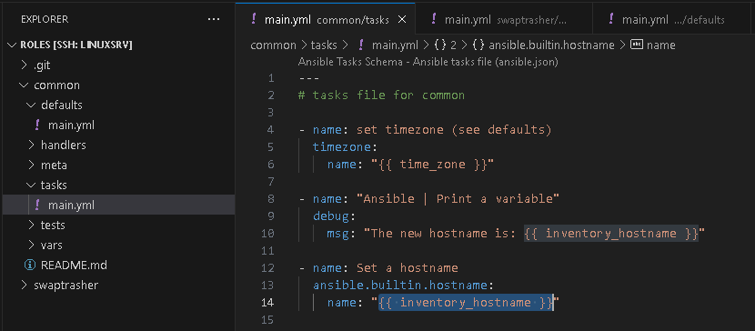
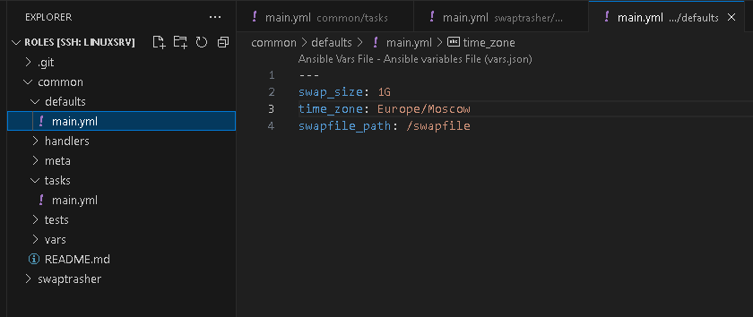
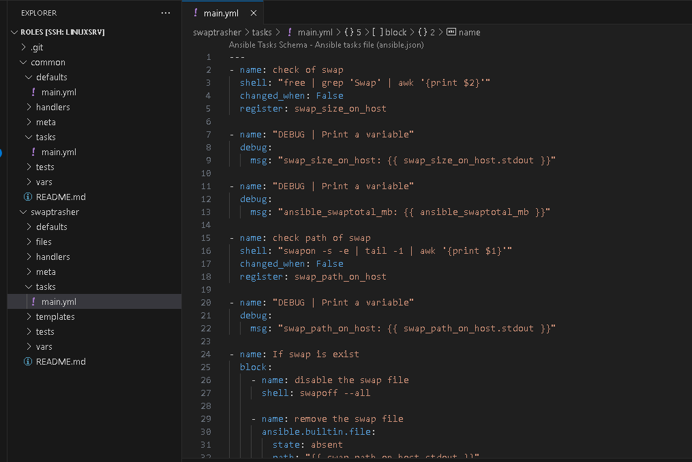
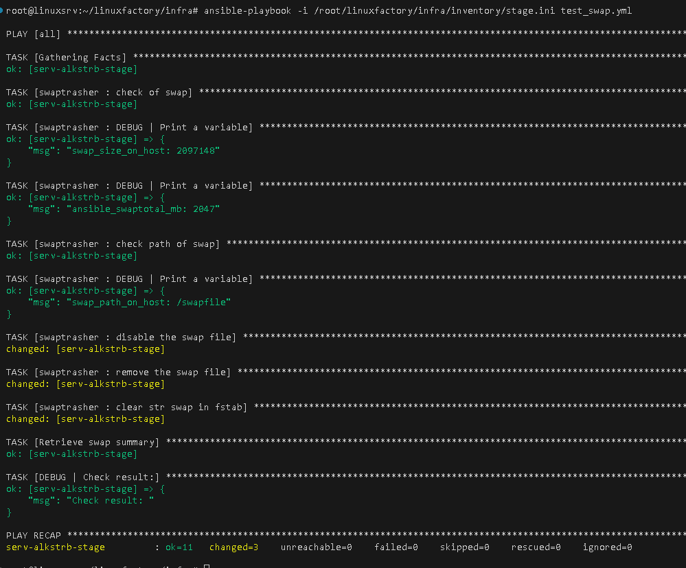

# #s1e6 Ansible 

## Задача 1

## Задача 2

## Задача 3: Roles - swaptrasher 

## Links

[INFRA repo:](https://github.com/AleksTurbo/infra)

[ansible-roles:](https://github.com/AleksTurbo/ansible-roles)
