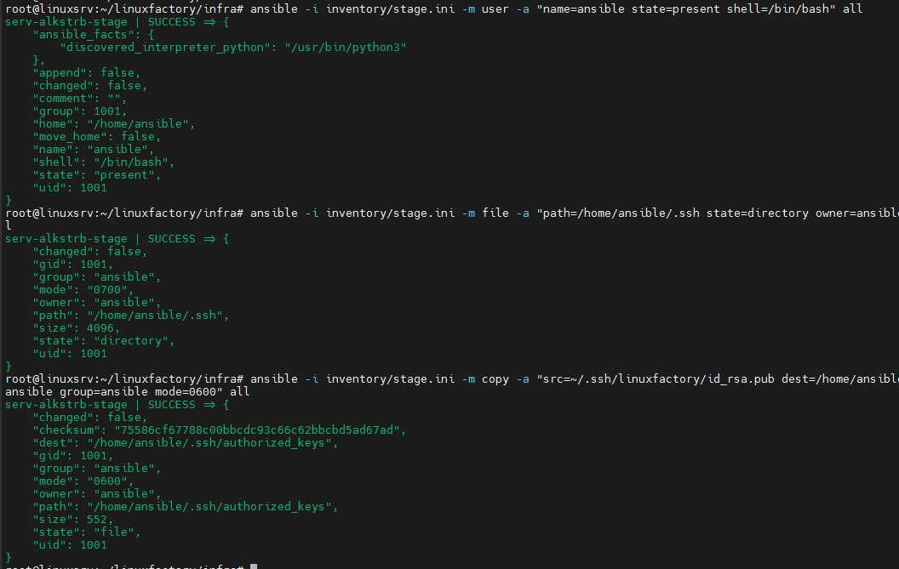
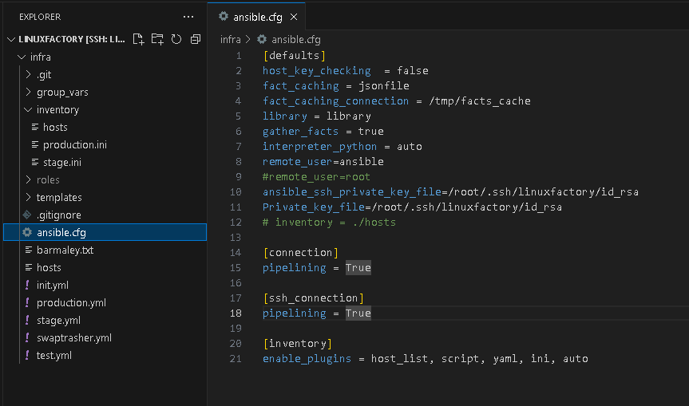
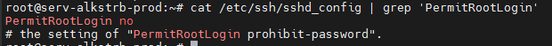
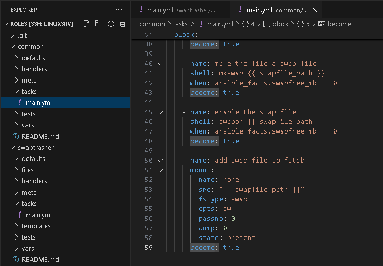

# #s1e7 Ansible

## Создаем пользователя

## Отключаем вход для root

## Адаптируем роли

## Links

[INFRA repo:](https://github.com/AleksTurbo/infra)

[ansible-roles:](https://github.com/AleksTurbo/ansible-roles)
