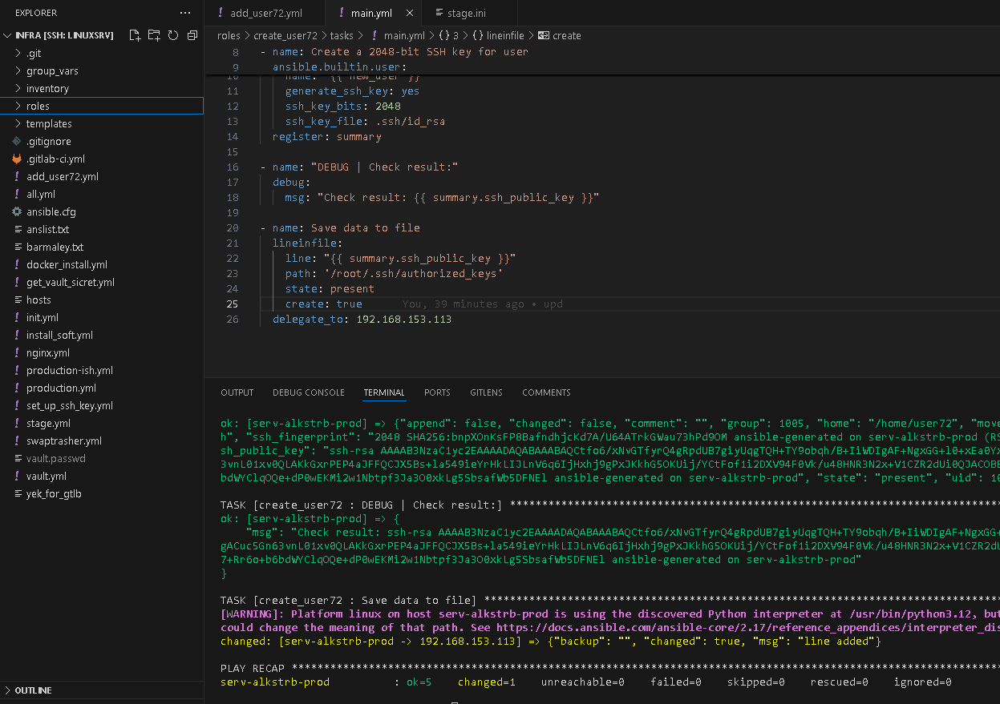
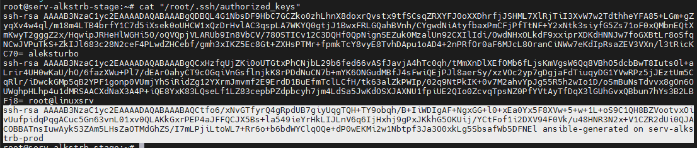
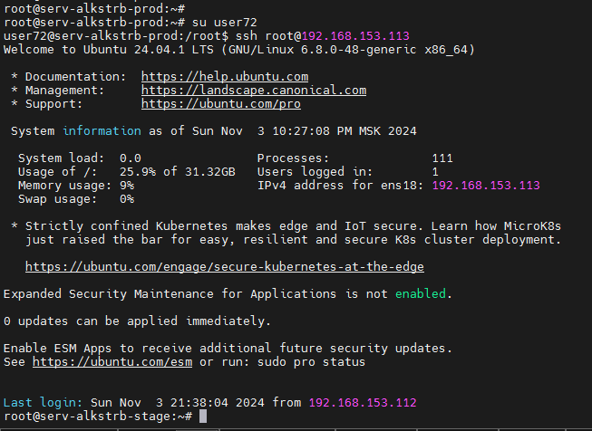

# #s2e10 Сквозняк

## Делаем роль по созданию пользователя user72 и генерации ssh ключа

[Create user role:](https://github.com/AleksTurbo/ansible-roles/blob/main/create_user72/tasks/main.yml)

SSH key on root@stage

Check SSH login to stage

## Links

[GitHUB REPO ansible-roles:](https://github.com/AleksTurbo/ansible-roles)

[GitHUB REPO Infra:](https://github.com/AleksTurbo/infra)
