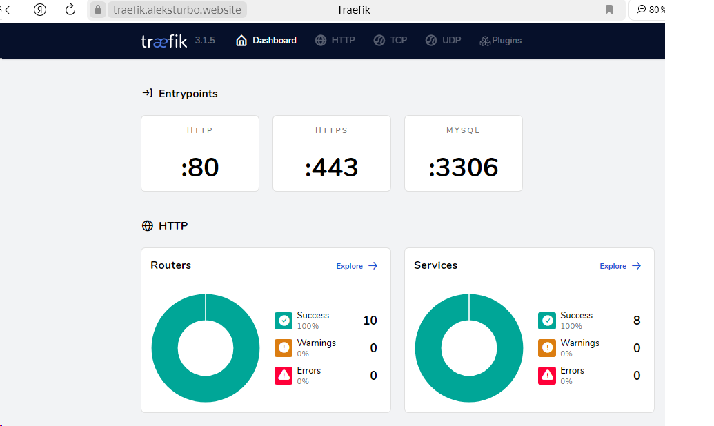
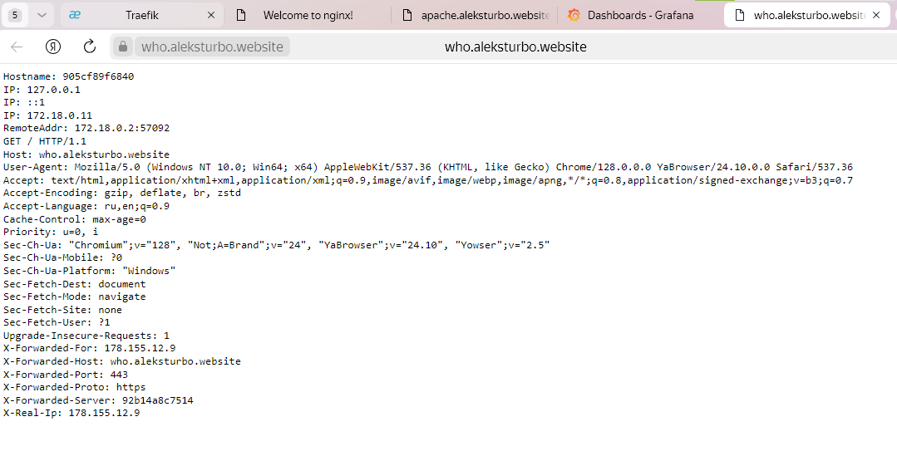
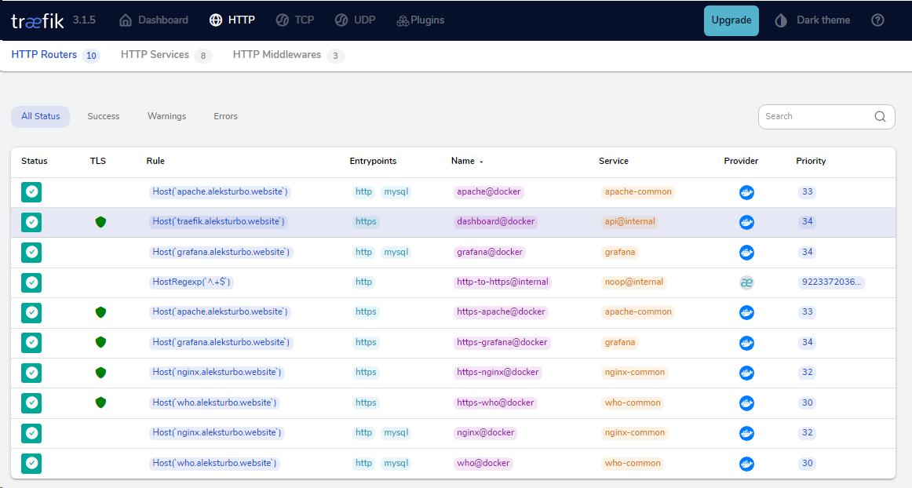
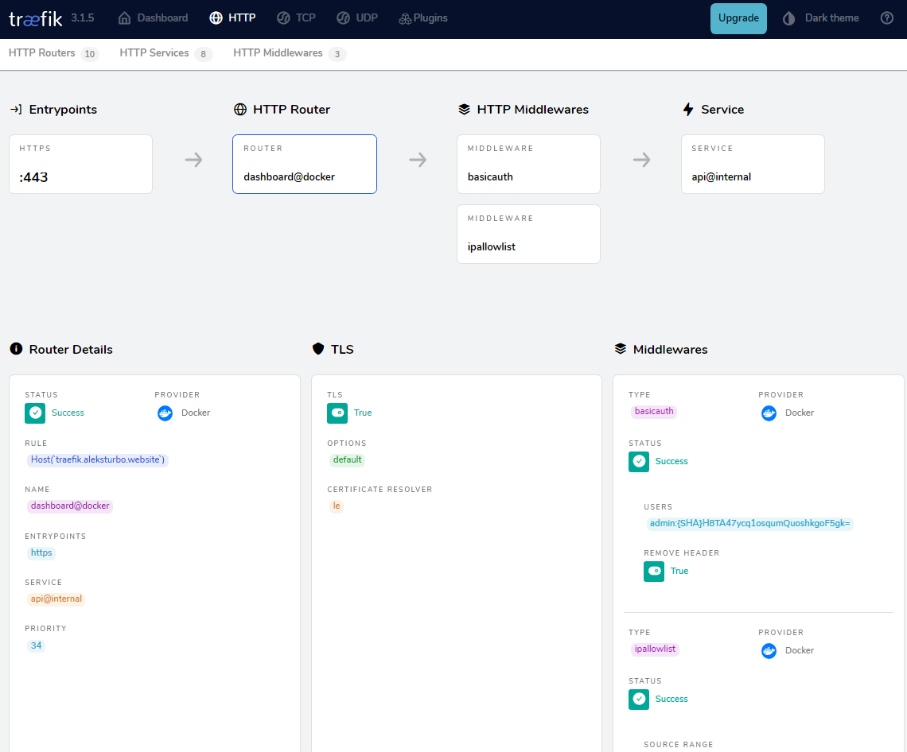
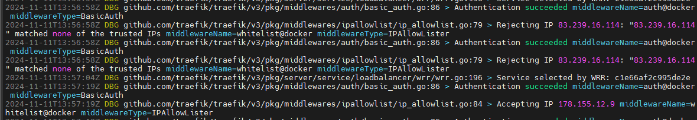

# #s2e11 Traefik

## Подготавливаем новый проект

[Traefik service:](https://github.com/AleksTurbo/service)

[DashBoard:](https://traefik.aleksturbo.website)

IP-allowlist

## Links

[Traefik service:](https://github.com/AleksTurbo/service)

[DashBoard:](https://traefik.aleksturbo.website)
