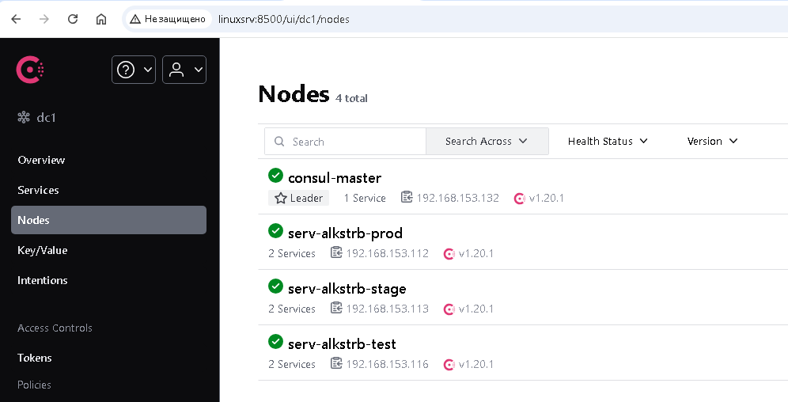
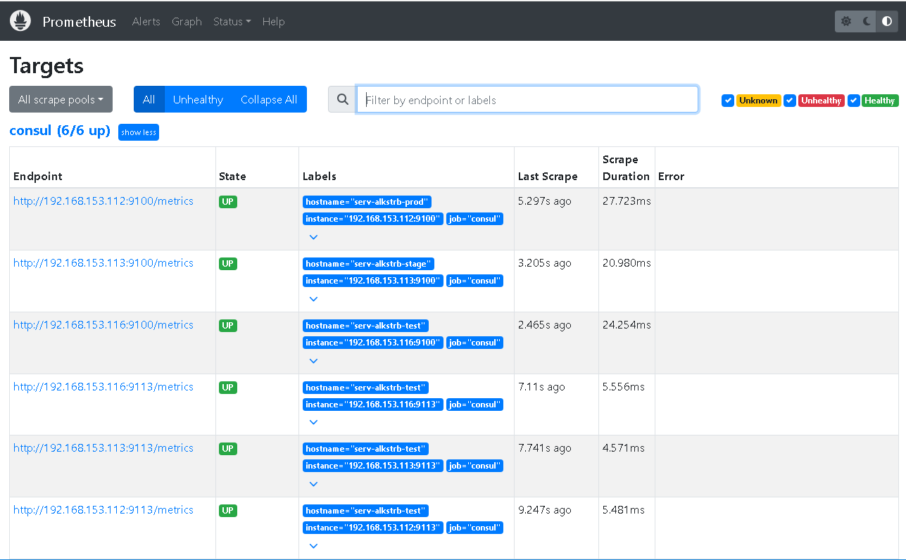
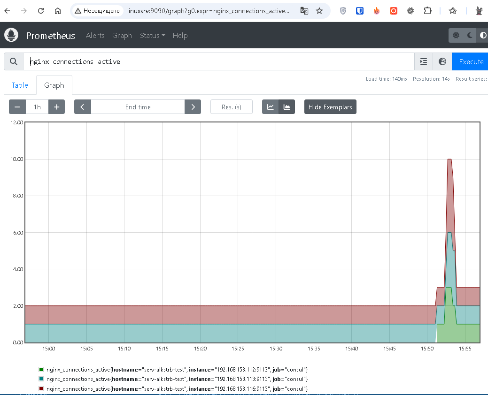

# #s2e14 Consul Большой брат №2

## Ноды в CONSUL

## Links

[consul_master:](https://github.com/AleksTurbo/ansible-roles/tree/main/consul_master)

[consul_agent:](https://github.com/AleksTurbo/ansible-roles/tree/main/consul_agent)

[node_exporter:](https://github.com/AleksTurbo/ansible-roles/tree/main/node_exporter)

[node_exporter:](https://github.com/AleksTurbo/ansible-roles/tree/main/nginx_exporter)

[INFRA repo:](https://github.com/AleksTurbo/infra)

[ansible-roles:](https://github.com/AleksTurbo/ansible-roles)
