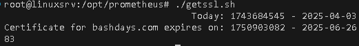
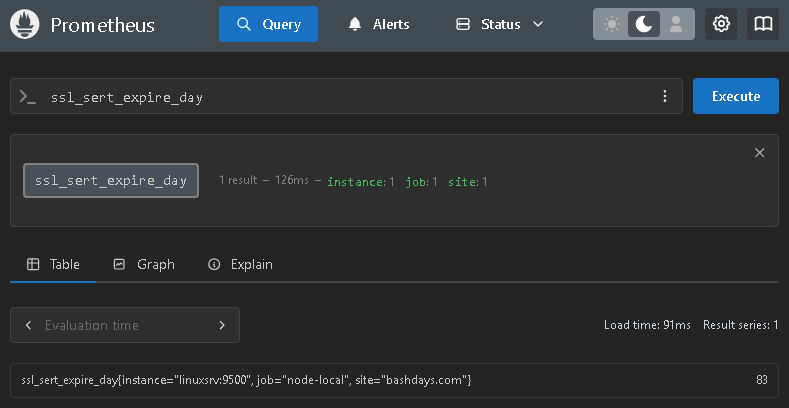
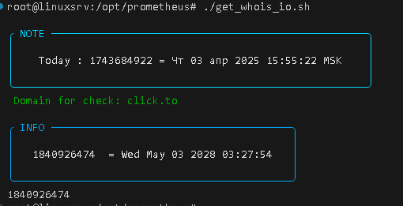
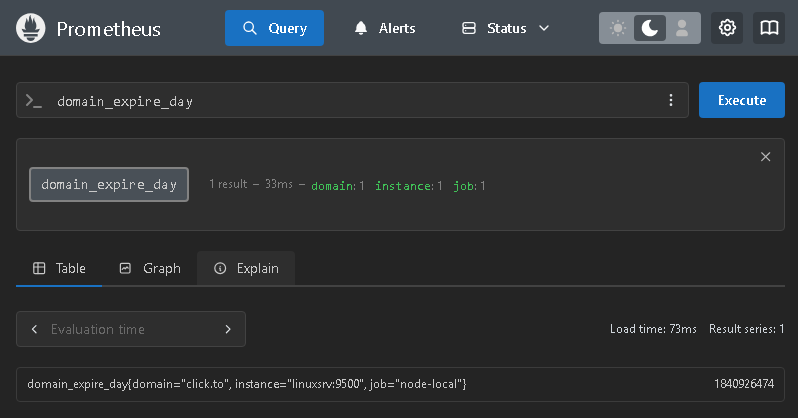

# #s2e17 Тотальный экспорт

## Срок действия сертификата https://bashdays.com

[getssl check script:](./scripts/getssl.sh)

## Проверка срока регистрации домена

[getssl check script:](./scripts/get_whois_io.sh)

## Links

[INFRA repo:](https://github.com/AleksTurbo/infra)
