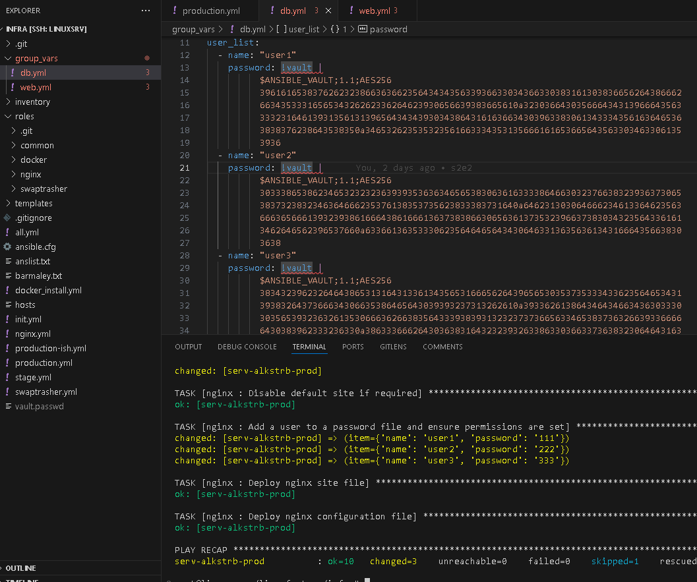
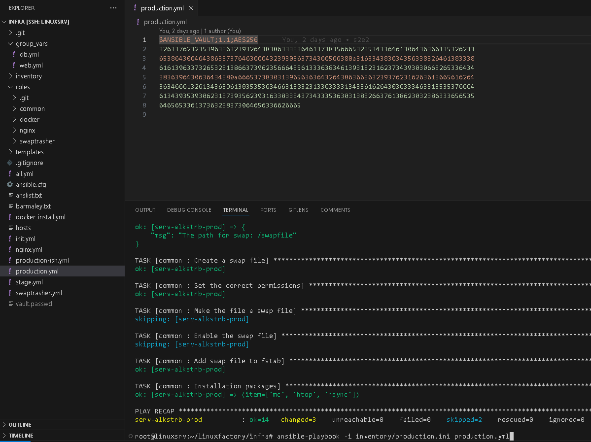

# #s2e2 GitLAb API

## Задача 1 - Шифруем пароли доступа

## Задача 1 - Шифруем плейбук

## Links

[INFRA repo:](https://github.com/AleksTurbo/infra)

[ansible-roles:](https://github.com/AleksTurbo/ansible-roles)
