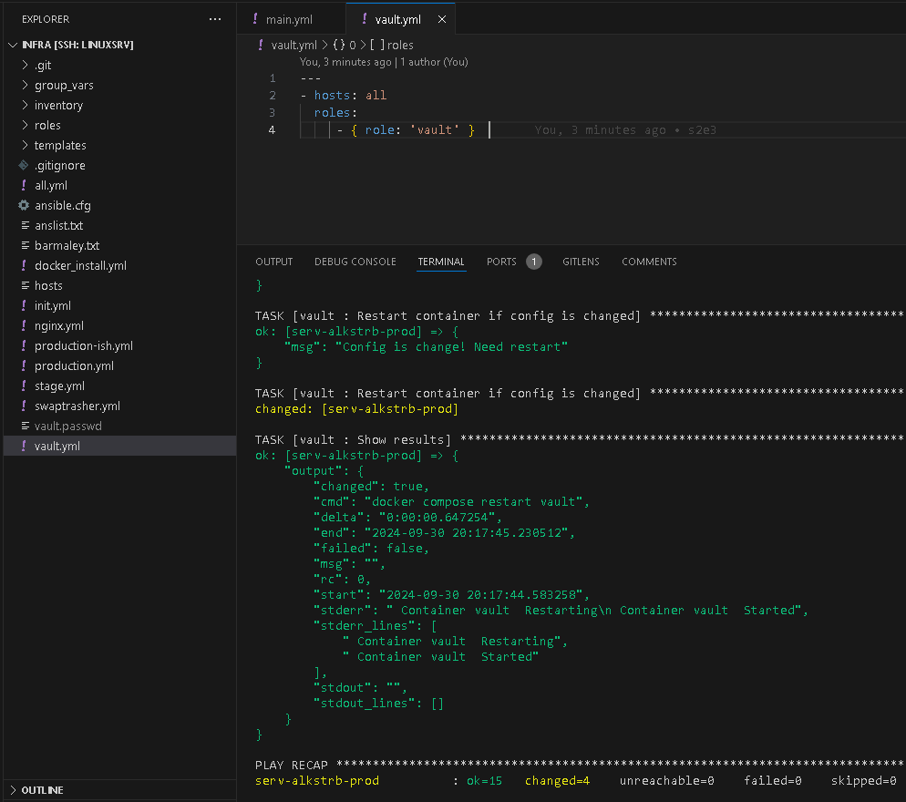
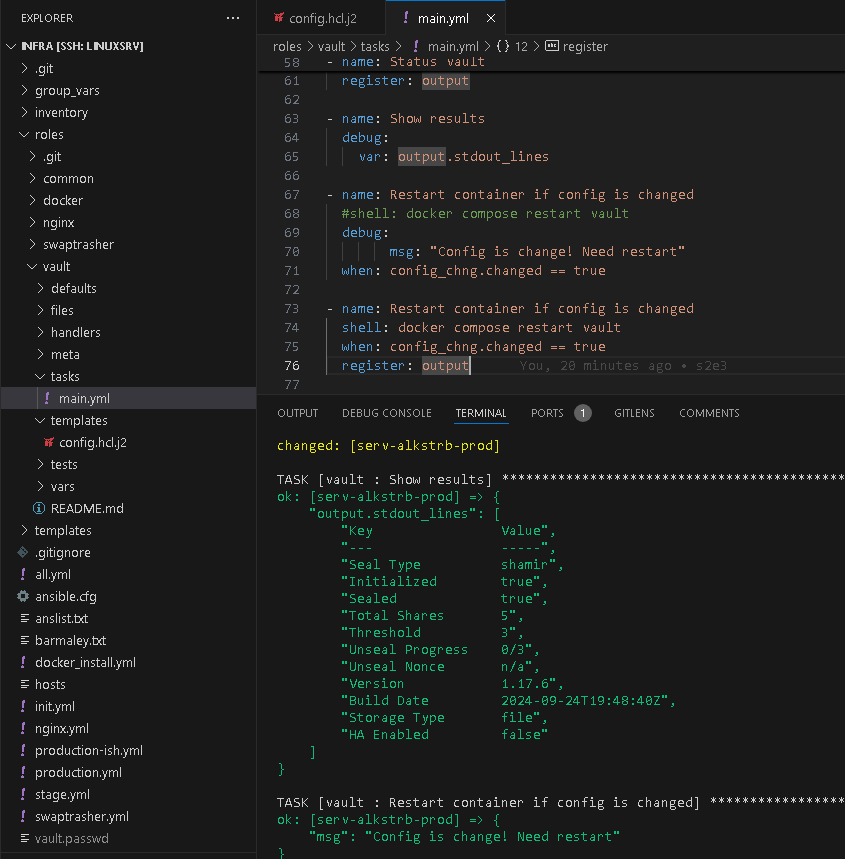
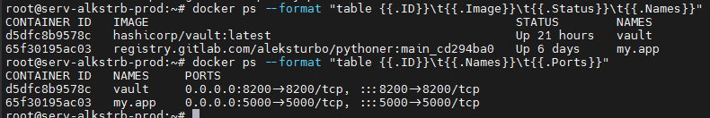
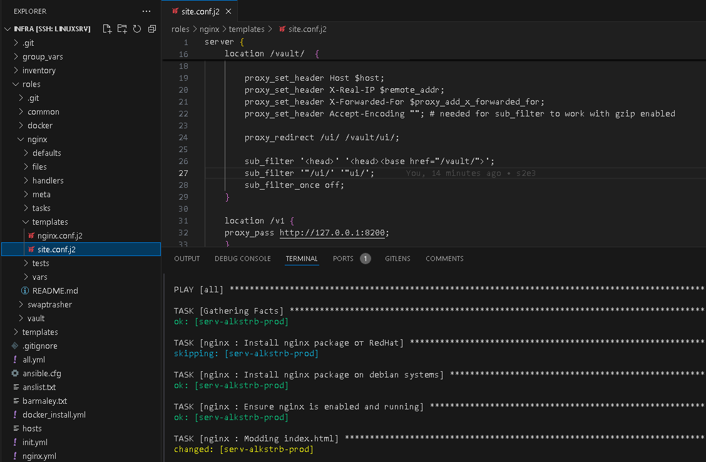
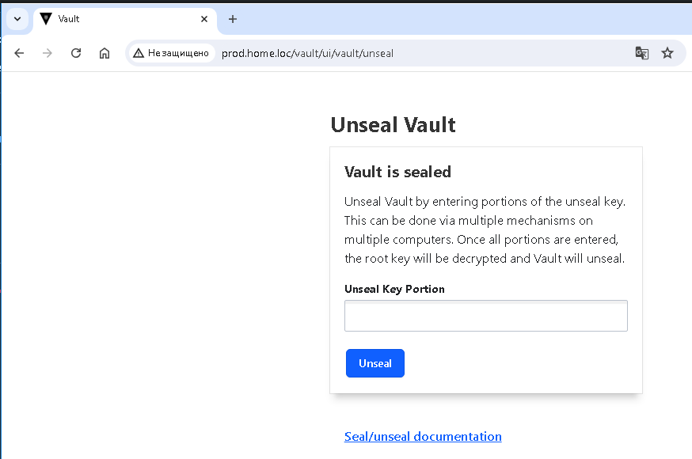
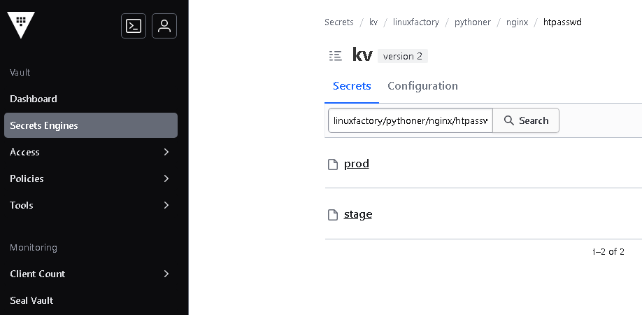

# #s2e3 VAULT

## Задача 1 - Роль Vault

[ansible-roles:](https://github.com/AleksTurbo/ansible-roles)

## Задача 2 - Модифицируем NGINX

## Задача 3 - Cекреты в Vault

## Links

[INFRA repo:](https://github.com/AleksTurbo/infra)

[ansible-roles:](https://github.com/AleksTurbo/ansible-roles)
