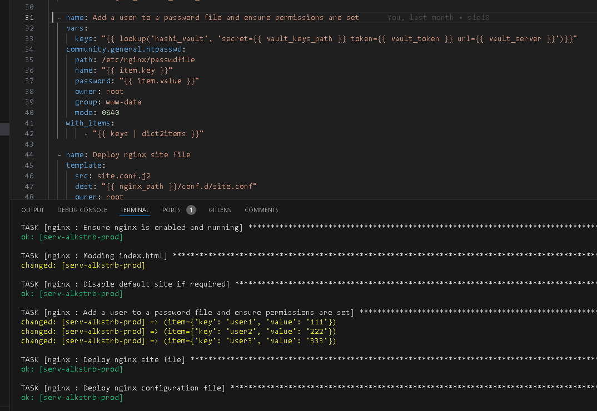

# #s2e4 VAULT Химера

## Задача 1 - Заполняем htpasswd из Vault

```yml
  - name: Add a user to a password file and ensure permissions are set
    vars:
      keys: "{{ lookup('hashi_vault', 'secret={{ vault_keys_path }} token={{ vault_token }} url={{ vault_server }}')}}"
    community.general.htpasswd:
      path: /etc/nginx/passwdfile
      name: "{{ item.key }}"
      password: "{{ item.value }}"
      owner: root
      group: www-data
      mode: 0640
    with_items:
        - "{{ keys | dict2items }}"
```



## Задача 2 - Прописываем ssh ключи из Vault


## Links

[INFRA repo:](https://github.com/AleksTurbo/infra)

[ansible-roles:](https://github.com/AleksTurbo/ansible-roles)
