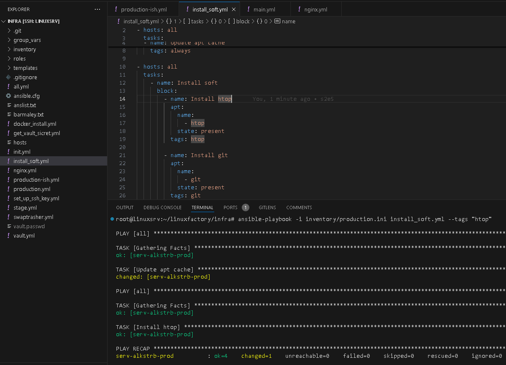

# #s2e5 Ansible tags

## Задача 1 - Playbook with tags

[install_soft:](https://github.com/AleksTurbo/infra/blob/main/install_soft.yml)

## Links

[INFRA repo:](https://github.com/AleksTurbo/infra)

[ansible-roles:](https://github.com/AleksTurbo/ansible-roles)
