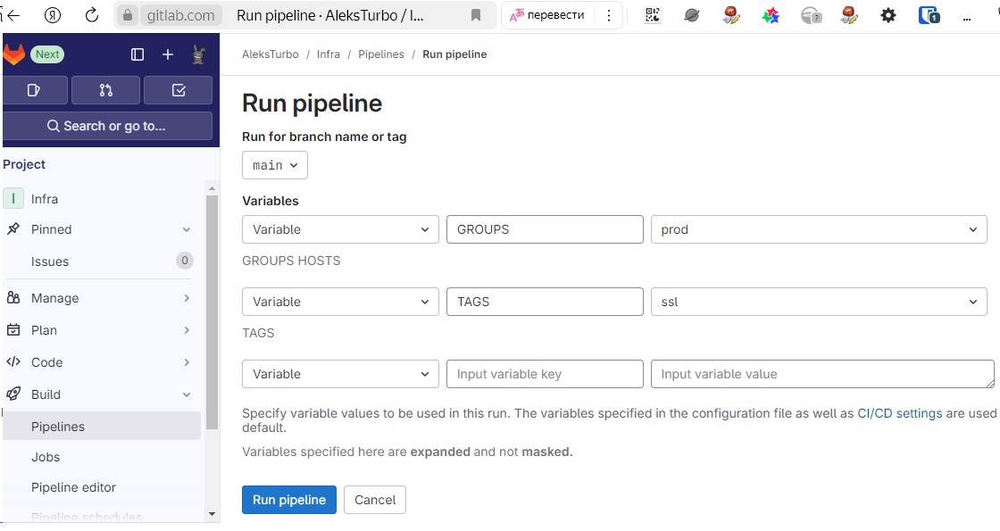
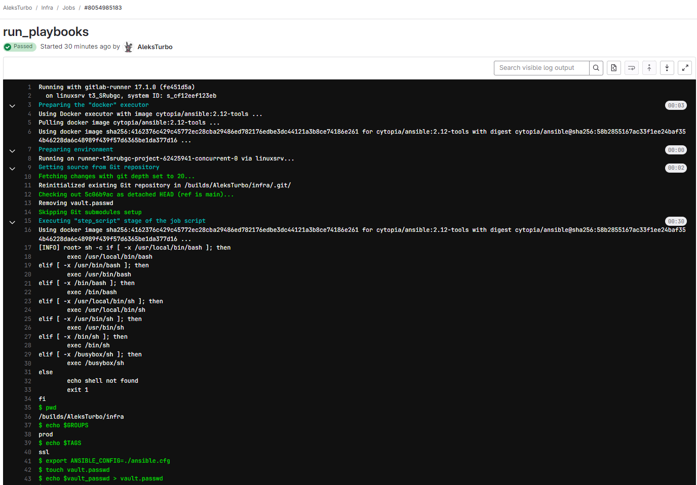
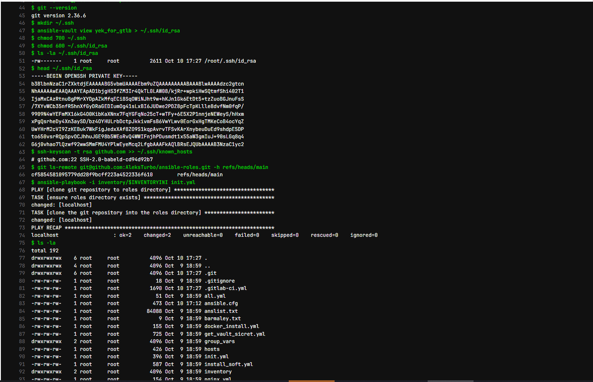
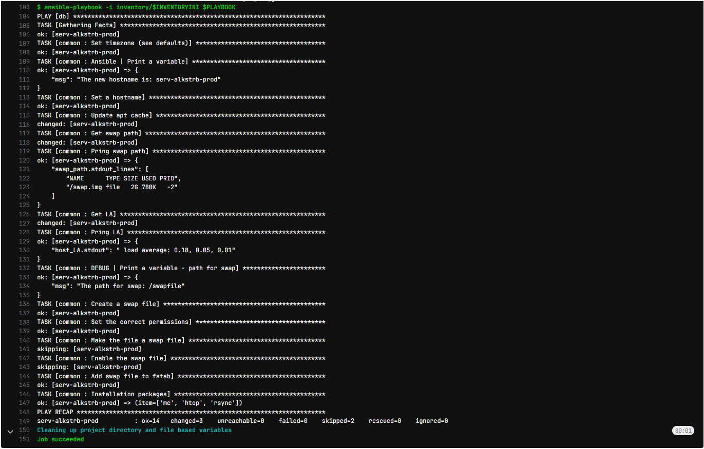

# #s2e6 Ansible CI/CD

## Задача 1 - GitLAB CI/CD + Ansible

Делаем .gitlab-ci.yml:

[gitlab-ci.yml:](./gitlab-s2e6/.gitlab-ci.yml)

[GitLAB gitlab-ci.yml:](https://gitlab.com/AleksTurbo/infra/-/blob/main/.gitlab-ci.yml)

## Links

[GitLAB INFRA:](https://gitlab.com/AleksTurbo/infra/)

[INFRA repo:](https://github.com/AleksTurbo/infra)

[ansible-roles:](https://github.com/AleksTurbo/ansible-roles)
