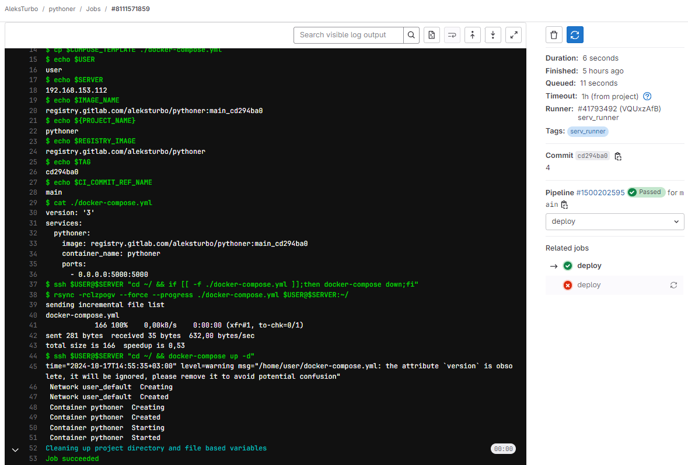
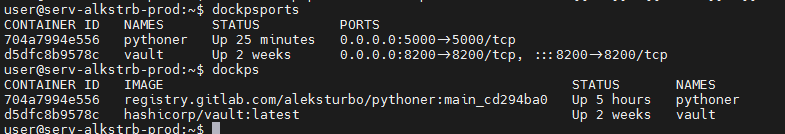

# #s2e8 GitLab & Docker

## Задача 1 - GitLAB CI/CD Docker compose

Изменяем .gitlab-ci.yml:

[GitLAB devops-pipelines gitlab-ci.yml:](https://gitlab.com/AleksTurbo/devops-pipelines/-/blob/main/pythoner/.gitlab-ci.yml)

## Links

[GitLAB pythoner REPO:](https://gitlab.com/AleksTurbo/pythoner/)

[GitLAB devops-pipelines ](https://gitlab.com/AleksTurbo/devops-pipelines/)
