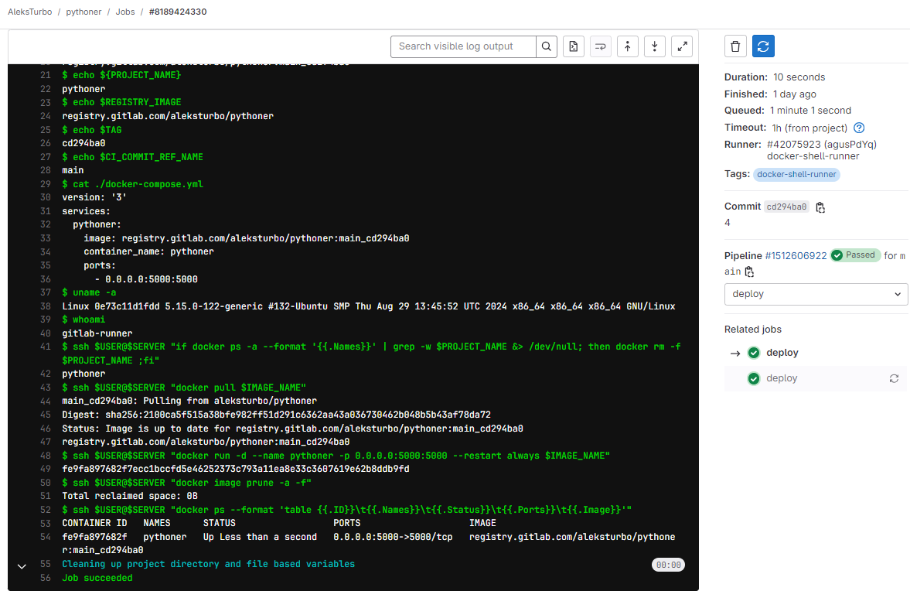

# #s2e9 Бегуны в коробке

## Переводим ранеры в докер


/srv/gitlab-runner/config/config.toml

```yaml
[runners.docker]
    tls_verify = false
    image = "docker:dind"
    privileged = true
    disable_entrypoint_overwrite = false
    oom_kill_disable = false
    disable_cache = false
    volumes = ["/var/run/docker.sock:/var/run/docker.sock", "/home/runner/.ssh:/home/gitlab-runner/.ssh", "/cache"]
    shm_size = 0
    network_mtu = 0
```

[GitLAB devops-pipelines gitlab-ci.yml:](https://gitlab.com/AleksTurbo/devops-pipelines/-/blob/main/pythoner/.gitlab-ci.yml)




## Links

[GitLAB pythoner REPO:](https://gitlab.com/AleksTurbo/pythoner/)

[GitLAB devops-pipelines ](https://gitlab.com/AleksTurbo/devops-pipelines/)
